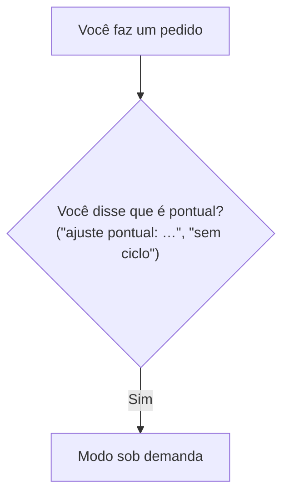

# Página com a classe do caso real (784ba51)

```mermaid
flowchart TD
    A["Você faz um pedido"] --> D{"Você disse que é pontual?<br/>(&quot;ajuste pontual: …&quot;, &quot;sem ciclo&quot;)"}
    D -- "Sim" --> E["Modo sob demanda"]
```
