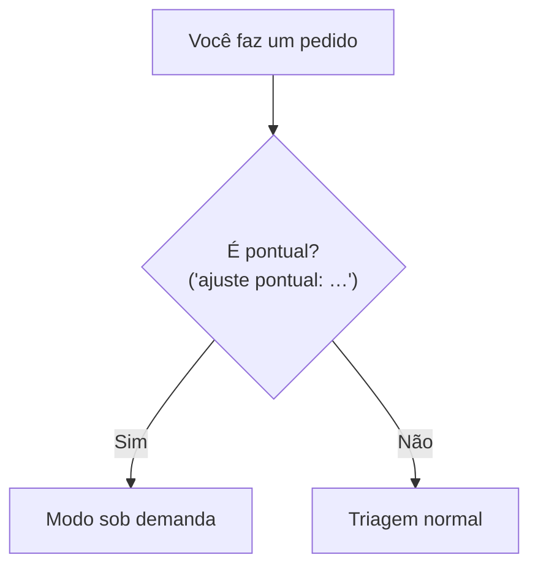

# Página com diagrama válido

Texto antes.

```mermaid
flowchart TD
    A["Você faz um pedido"] --> B{"É pontual?<br/>('ajuste pontual: …')"}
    B -- "Sim" --> C["Modo sob demanda"]
    B -- "Não" --> D["Triagem normal"]
```

Texto depois.
